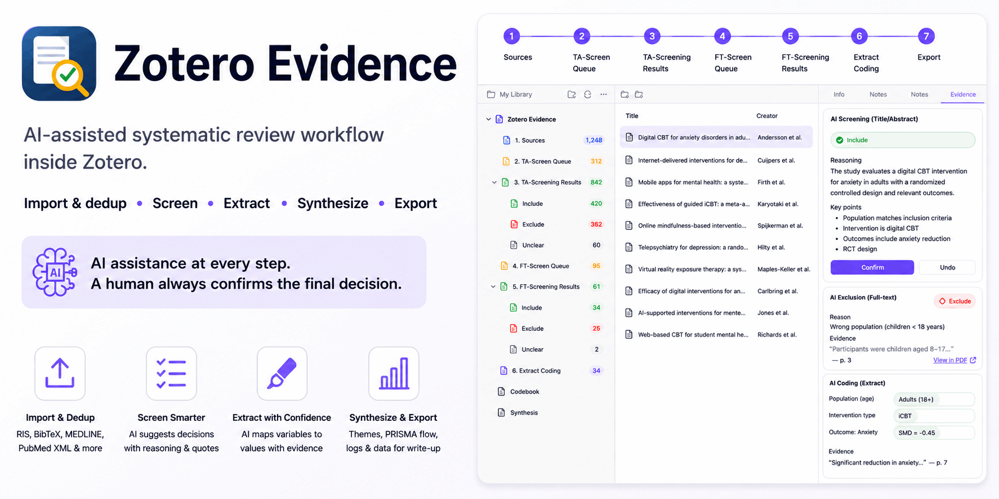

<p align="center">
  
</p>

# Zotero Evidence

[](https://github.com/windingwind/zotero-plugin-template)
[](LICENSE)
[](https://www.zotero.org)
[](https://github.com/etShaw-zh/zotero-evidence/releases)

> [!WARNING]
> Under high-frequency development — features and data formats can still change between releases.

## Features

- **Import & dedup** — import RIS/BibTeX/MEDLINE/PubMed XML; duplicates removed automatically.
- **Title/Abstract screening** — AI suggests Include/Exclude/Unclear for each paper with reasoning; you confirm.
- **Full-text screening** — AI checks each paper against every criterion with highlighted evidence; you confirm.
- **Extract coding** — AI extracts data into your Codebook, backed by highlighted quotes; you confirm.
- **Batch AI runs** — select multiple items and run TA/FT screening or Coding AI in batch.
- **Synthesis** — AI groups confirmed evidence into themes with one click.
- **Consistency** — measure AI-human agreement (`Cohen's ϰ`), or sample a batch for two reviewers to co-screen.
- **Export** — PRISMA data, screening log, coding data, synthesis output, and the Codebook itself (CSV).
- **Archive & share** — export a project as a `.zip` to back up or share; restore it anywhere.

## Getting started

1. Install the plugin in Zotero 7 or later.
2. **File → AI Settings → AI Provider Settings…** — set endpoint, model, API key, and concurrency.
3. **File → Evidence Project → New Project…**, then **File → Import Literature → Import to Sources…**.
4. **File → Screening Criteria →** define one set of inclusion/exclusion criteria.
5. **File → Codebook →** define variables (or import from CSV) before coding begins.
6. Work through `TA-Screen Queue` → `FT-Screen Queue` → `Extract Coding`.
7. **File → Consistency Calculation → Human-AI Screening Consistency…**.
8. **File → Synthesis Analysis → Theme Mining…**, then **File → Export Data** when ready to write up.
9. **File → Evidence Project → Archive Project…** to back up or share a project as a `.zip`.

## Advanced usage

For a second opinion instead of just AI-vs-human:

1. **File → Consistency Calculation → Human-Human Screening Consistency…**, pick a sample size, then save the sampled archive.
2. Send that `.zip` to two reviewers. Each restores it separately and independently screens every sampled item through TA _and_ FT in their own copy, then exports their own screening log.
3. Import both reviewers' CSVs back into the dialog — `Cohen's ϰ` is computed automatically, and you can start another round any time.
4. Click **Apply Agreed Results**: items both reviewers agreed on become the project's official result; items they disagreed on stay in `TA-Screen Queue`, flagged with a colored tag so they're easy to spot in the items list, with both reviewers' calls shown right in the sidebar for a third reviewer to resolve through the normal screening flow.

Repeat steps 1–4 as many times as you like, and every round's own agreement/ϰ stays listed in the dialog.

## Development

Built with [zotero-plugin-scaffold](https://github.com/northword/zotero-plugin-scaffold) and [zotero-plugin-toolkit](https://github.com/windingwind/zotero-plugin-toolkit).

```sh
git clone https://github.com/etShaw-zh/zotero-evidence.git
cd zotero-evidence
cp .env.example .env   # set ZOTERO_PLUGIN_ZOTERO_BIN_PATH and a dev profile
npm install
```

- `npm start` — dev server with hot reload
- `npm test` — run the test suite inside a real Zotero instance
- `npm run build` — production build (`.scaffold/build/`)
- `npm run lint:check` / `npm run lint:fix` — Prettier + ESLint
- `npm run release` — bump version and publish

```
src/
|-- hooks.ts          # lifecycle hooks, File-menu dispatch
|-- modules/
|   |-- project/      # project + Collection structure
|   |-- import/       # Zotero.Translate.Import wrapper
|   |-- dedup/        # DOI-first / title+author+year dedup
|   |-- screening/    # TA judgment, FT per-criterion checklist, criteria, decisions
|   |-- consistency/  # Human-AI & human-human screening consistency (Kappa)
|   |-- coding/       # Codebook + Extract Coding services
|   |-- synthesis/    # theme mining over confirmed coding evidence
|   |-- pdf/          # text extraction, quote location, highlights
|   |-- ai/           # AI provider config, chat completions, usage tracking
|   |-- export/       # PRISMA / screening log / coding export
|   |-- archive/      # project archive export/restore (.zip)
|   |-- db/           # SQLite schema and migrations
|   `-- ui/           # item-pane sections and dialogs
addon/                # manifest, locales, static content
test/                 # Mocha suite, run inside Zotero via `npm test`
```

## License

Copyright © 2026 [Jianjun Xiao](mailto:et_shaw@126.com). AGPL-3.0-or-later, see [LICENSE](LICENSE).
